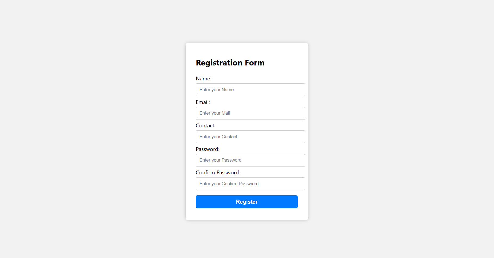

# 📝 Simple Registration Form with Validation

A beginner-friendly **HTML + CSS + JavaScript** project that validates user input in a registration form.  
Perfect for those starting with JavaScript and DOM manipulations.

---

## 🔍 Features

✅ Real-time form validation  
✅ Custom error messages  
✅ Regex for name and contact number validation  
✅ DOM manipulation with JavaScript  
✅ Clean & responsive UI

---

## 💡 What I Learned

This is my **first ever JavaScript-based** mini-project!  
Here’s what I explored:

- `addEventListener` to handle form submission
- `Regex` to validate name and contact number
- `DOM methods` like `getElementById()` and `.value`
- Conditional logic and `preventDefault()` to stop form reload
- Error message handling with `innerText`

---

## 💻 Tech Used

- HTML5  
- CSS3  
- JavaScript (Vanilla)  
- No external libraries or frameworks

---

## 📸 UI Preview

---

